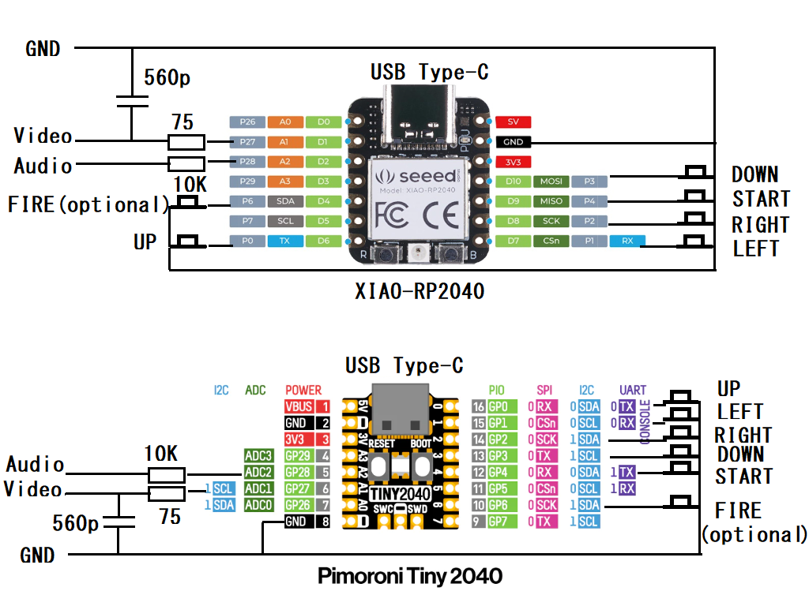

# NTSC Video PACMAN for RP2040
Raspberry Pi PicoやSeeed XIAO RP2040、Pimoroni Tiny2040等で動作するNTSCビデオ出力によるパックマンゲームです。抵抗2本、コンデンサ1本、ボタン5個と接続ケーブルだけでテレビゲームが実現します。  
RP2040のPWM機能によるNTSCビデオ出力ライブラリを利用しました。  
https://github.com/KenKenMkIISR/rp2040_pwm_ntsc_textgraph2  
## 実行方法
uf2バイナリファイルを用意したので、XIAO RP2040、Tiny2040ではpacman-xiao2040.uf2、MachiKania type Pではpacman-machikaniap.uf2を書き込んでください。  
## 接続
XIAO-RP2040、Tiny2040は以下の図の接続となります。FIREボタンはPACMANでは使用しないためオプションです。抵抗、コンデンサはこの値と同じである必要はありません。近いものを使ってください。映像、音声ケーブルのGNDも忘れずに接続してください。  
MachiKania type Pでは映像はGP27から出力されるので同様に抵抗とコンデンサをつないでください。音声と6個のボタンは基板のものを使用します。液晶は取り外してください。  
  
  
XIAO RP2040での動作  
  
  
Tiny2040での動作  
  
  
MachiKania type Pでの動作  
  
